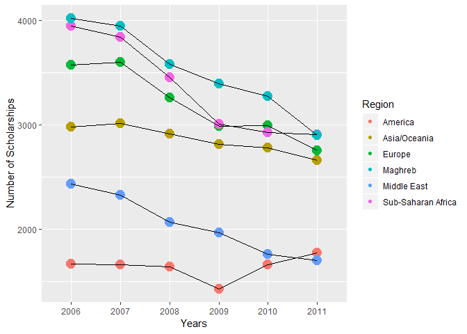

French Government Scholarships to Foreign Students
================
Karine G
28 septembre 2018

Introduction
------------

French government scholarships are allocated by the Ministry for Europe and Foreign Affairs for studies, training courses and language courses in France.

<https://www.diplomatie.gouv.fr/en/coming-to-france/studying-in-france/finance-your-studies-scholarships/>

We have here a look at their geographical repartition by world region 2006-2011 thanks to open data published by the French authorities.

French government scholarships to foreign students
--------------------------------------------------

The dataset is a csv file provided by the official French governmental platform for open data and features the number of scholarships to foreign students provided by the French government from 2006 through 2011.

<https://www.data.gouv.fr/fr/datasets/boursiers-du-gouvernement-francais/#_>

### Loading packages

Checking first the packages we will use are already available else downloading them. Opening: R.utils, data.table, here, tidyr, dplyr, readr, ggplot2, sf, RColorBrewer.

``` r
packages <- c("R.utils", "data.table", "here", "ggplot2", "sf", "readr", "dplyr", "tidyr", "RColorBrewer")

for (package in packages) {
        if (!require(package, character.only=T, quietly=T)) {
                install.packages(package)}
        library(package, character.only=T)
        }
```

### Importing the data

Let's import the dataset in a subfolder of the current file directory.

``` r
### Source: https://www.data.gouv.fr/fr/datasets/boursiers-du-gouvernement-francais/#_ 
here()
WD <- getwd()
if (!is.null(WD)) setwd(WD)
dataUrl <- 'http://www.data.gouv.fr/fr/datasets/r/dd3b4807-d90c-46fe-b03a-2ad250db979f'
dir.create("originalData", showWarnings = F)
download.file(dataUrl, "./originalData/myData.csv")
```

Now, let's have a look at a piece of the dataset we loaded down.

``` r
globalData <- read.table("originalData/myData.csv", sep=";")
print(globalData[1:11,1:4])
```

    ##                                                     V1    V2    V3    V4
    ## 1                                                MONDE                  
    ## 2  Evolution*  du nombre des boursiers (BGF) 2006-2011                  
    ## 3                                                       2006  2007  2008
    ## 4                                     Union européenne 1 795 1 732 1 556
    ## 5                                     Europe (hors UE) 1 780 1 870 1 703
    ## 6                                         TOTAL EUROPE 3 575 3 602 3 259
    ## 7                                     Amérique du Nord   171   146   154
    ## 8                                     TOTAL AMERIQUE * 1 665 1 660 1 636
    ## 9                                   TOTAL ASIE OCEANIE 2 983 3 015 2 915
    ## 10                                        MOYEN-ORIENT 2 435 2 326 2 067
    ## 11                  Afrique Sub saharienne francophone 3 337 3 283 2 950

Tidying the data
----------------

We subselect the rows and columns in order to have a dataset we can work on. To get useful numbers to do computations with, we must convert those in the dataset to numeric (and transit through the character format for that purpose, - while applying some regex through the "sub" function in order to remove blanks within large numbers).

``` r
tidyData <- globalData[4:15,2:7] %>% 
        apply(2, as.character) %>% 
        sub(" ", "", .) %>% 
        apply(2, as.numeric) %>%
        as.data.frame(.)
```

Then, let's get a more conventional presentation with rows, not columns, indicating years. Hence, a transposing of the matrix through the 't' function is effected. In order to use ggplot2 conveniently, years are added as a column in itself. Normalized labels are used for the regions instead of the full names.

``` r
Years <- as.factor(as.character(c(2006:2011)))
finalTidy <- as.data.frame(t(tidyData)) %>% 
        cbind(Years, .)
Regions <- c("Years", "EU", "EurNotEU", "Total_Eur", "Am_N", "Total_Am", "Total_Asia_O", "Middle_E", "AfSubS_F", "AfSubS_nF","Total_AfSubS", "Maghreb", "Total_Ge")
colnames(finalTidy) <- Regions
rownames(finalTidy) <- Years
print(finalTidy)
```

    ##      Years   EU EurNotEU Total_Eur Am_N Total_Am Total_Asia_O Middle_E
    ## 2006  2006 1795     1780      3575  171     1665         2983     2435
    ## 2007  2007 1732     1870      3602  146     1660         3015     2326
    ## 2008  2008 1556     1703      3259  154     1636         2915     2067
    ## 2009  2009 1438     1548      2986  134     1427         2812     1962
    ## 2010  2010 1345     1646      2991  122     1655         2777     1761
    ## 2011  2011 1271     1484      2755   97     1770         2662     1697
    ##      AfSubS_F AfSubS_nF Total_AfSubS Maghreb Total_Ge
    ## 2006     3337       613         3950    4021    18629
    ## 2007     3283       560         3843    3947    18393
    ## 2008     2950       505         3455    3580    16912
    ## 2009     2590       420         3010    3393    15590
    ## 2010     2466       459         2925    3271    15380
    ## 2011     2503       403         2906    2897    14687

### Data vizualization

``` r
data_Eur <- cbind(finalTidy[,c(1,4)], Region=rep("Europe", 6))
data_Am <- cbind(finalTidy[,c(1,6)], Region=rep("America", 6))
data_Asia <- cbind(finalTidy[,c(1,7)], Region=rep("Asia/OCeania", 6))
data_ME <- cbind(finalTidy[,c(1,8)], Region=rep("Middle East", 6))
data_Afr <- cbind(finalTidy[,c(1,11)], Region=rep("Sub-Saharan Africa", 6))
data_Magh <- cbind(finalTidy[,c(1,12)], Region=rep("Maghreb", 6))


names(data_Eur)<- c("Years", "Total", "Region")
names(data_Am)<- c("Years", "Total", "Region")
names(data_Asia)<- c("Years", "Total", "Region")
names(data_ME)<- c("Years", "Total", "Region")
names(data_Afr)<- c("Years", "Total", "Region")
names(data_Magh)<- c("Years", "Total", "Region")

long_Data <- rbind(data_Afr, data_Am, data_Asia, data_Eur, data_Magh, data_ME)

#### DATA VIZ ####

ScholPlot <- ggplot(data=long_Data) + geom_point(aes(x=Years, y=Total, color = Region, size= 10)) +
        geom_line(aes(x=Years, y=Total, group = Region)) + guides(size=FALSE)
print(ScholPlot)
```



``` r
ggsave('ScholPlot.png', width = 16, height = 9, dpi = 100)
```

Creating a map
--------------

Preparing the shapefile.
MapSource <http://thematicmapping.org/downloads/TM_WORLD_BORDERS_SIMPL-0.3.zip> Shapefile is extracted from zip and used for the next steps.

``` r
#In order to work of the file and save time not downloading the shapefile every time, 
# and once you set your working directory to the current location, you might use 
# (comment/uncomment the following line in opposite way to what to have 
# for the preceding download/extract procedure:

region_location <- "WORLD_SIMPL/TM_WORLD_BORDERS_SIMPL-0.3.shp"

theRegions <- st_read(region_location)
```

    ## Reading layer `TM_WORLD_BORDERS_SIMPL-0.3' from data source `C:\Users\Kroutz-\Dropbox\MOOCS\DATA\DATA_Knight\R_FrenchScholarships\WORLD_SIMPL\TM_WORLD_BORDERS_SIMPL-0.3.shp' using driver `ESRI Shapefile'
    ## Simple feature collection with 246 features and 11 fields
    ## geometry type:  MULTIPOLYGON
    ## dimension:      XY
    ## bbox:           xmin: -180 ymin: -90 xmax: 180 ymax: 83.57027
    ## epsg (SRID):    4326
    ## proj4string:    +proj=longlat +datum=WGS84 +no_defs

``` r
myRegions <- tbl_df(theRegions) %>%
        select(NAME, SUBREGION, LON, LAT, geometry) %>%
        mutate(SUBREGION=as.factor(SUBREGION), NAME=as.character(NAME))
```

We must merge our own geographic repartition with the one from the shapefile. The shapefile indeed lists the world countries and groups them by regions and subregions (additional columns), but those don't match the world regions from our initial dataset. Some investigation into the data is here necessary.

So we create here a ne data frame "OrderedList" to order subregions by number and thus check the list (not published here, see the created data frame "OrderedList" if you want to reproduce step by step). This makes it easily then to peruse the document and find the logic behind the numbers, - and thus reassign countries by subregion number to "our" subregions from the original list we have for scholarships as a next step.

``` r
OrderedList <- myRegions[order(myRegions$SUBREGION),]
```

The shapefile's subregions (represented by specific numbers) are browsed through in this OrderedList data frame, - and reassigned to our \#own categories (some countries have to be extracted from their "subregion" and individually reassigned). Here what we found:

Middle East: 145 (+ Iran) EUR: 39,151,154,155 Maghreb: 15+Egypt+Sudan AfSubS: 11, 14, 17, 18 Asia\_0: 30,34, 35, 53, 54, 57, 61, 143

``` r
myRegions <- myRegions %>%
        mutate(Regions_schol = case_when
               (SUBREGION == 0 ~ "Antarctica_NA", 
                SUBREGION %in% c(39,151, 154, 155) ~ "Europe_2755",
                (SUBREGION  == 15 & NAME != "Egypt" & NAME !="Sudan") ~ "Maghreb_2997",
                SUBREGION %in% c(30, 34, 35, 53, 54, 57, 61, 143) ~ "AsiaOceania_2662",
                SUBREGION %in% c(5, 13, 21, 29) ~ "America_1770",
                (SUBREGION == 145 | NAME=="Iran (Islamic Republic of)"
                 | NAME == "Egypt")  ~ "MiddleEast_1697", 
                SUBREGION %in% c(11, 14, 17, 18) | NAME == "Sudan" ~ "SubSaharanAfrica_2906"
                 )) %>%
                separate(Regions_schol, c("Regions", "schol")) 
```

Now, let's do a map.

``` r
# Substituting the regional mean for LON and LAT,
# & Correcting LON/LAT for Asia & Oceania and Antartica Regions 
# to have them more conveniently placed on the map.

myRegions_notRegrouped <- myRegions
myRegions <- myRegions %>%
        group_by(Regions) %>%
        mutate(LON = mean(LON), LAT = mean(LAT),
               LON = case_when(Regions == "AsiaOceania" ~ LON+50, TRUE  ~ LON),
               LAT = case_when(Regions == "Antarctica" ~ LAT-50, TRUE ~ LAT))
```

Let's make a choropleth map with this.

``` r
myRegions$schol <- as.numeric(myRegions$schol)

myColors <- brewer.pal(12,"Set3") 
names(myColors) <- levels(as.factor(myRegions$Regions))

myMap <- ggplot(myRegions) + geom_sf(aes(fill=schol,color = Regions))+
        scale_fill_distiller(direction = 1, 
                             name =" Number of Scholarships", palette="Oranges")+
        labs(caption="Number of Scholarships Given by World Region in 2011", 
             subtitle="Scholarships to Foreign Students by the French Government")+
        geom_label(aes(x=LON, y=LAT), 
                   color="black", 
                   label=toupper(myRegions$Regions), size=1.7)+
        xlab("") + ylab("") +
        guides(color = FALSE)

print(myMap)
```


This choropleth map doesn't inform clearly enough. So let's try something else.

``` r
myMap2 <- ggplot(myRegions) + geom_sf(aes(fill=Regions,color = Regions))+
        scale_fill_brewer(palette="Set1")+
        labs(caption="Number of Scholarships Given by World Region in 2011", 
             title="World Repartition of French Government Scholarships")+
        geom_label(aes(x=LON, y=LAT), 
                   color="black", fill = "seashell", 
                   label=myRegions$schol, size=1.8)+
        xlab("") + ylab("")

print(myMap2)
```


